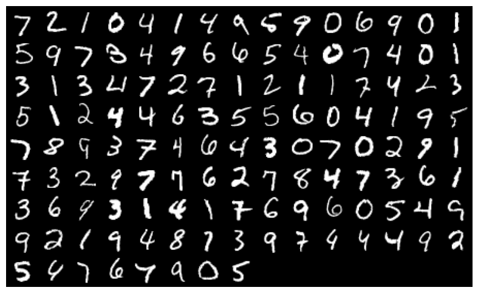
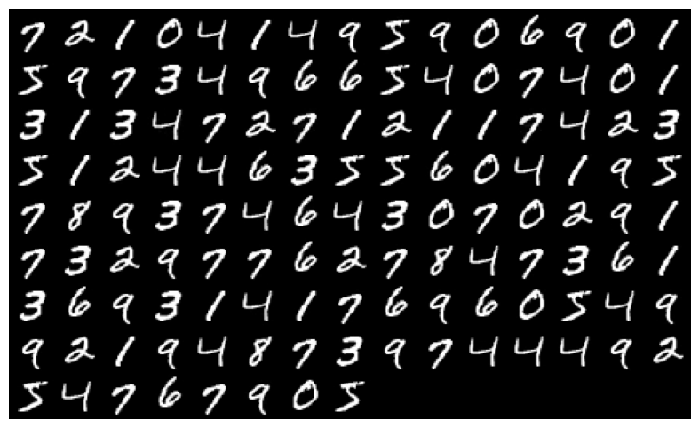

# Visual-Transformer-Generator
A Transformer-based Autoregressive Visual Image Generative Model

This project harnesses the power of transformer architectures to tackle the processing and generation of 2D image data. Motivated by the pioneering concept of Vision Transformer (ViT), where images are partitioned into patches and fed into a transformer network, this repository extends that idea. It not only utilizes encoder transformers for image encoding but also incorporates a decoder transformer to sample and assemble these encoded patches, ultimately generating a complete image.

## Key Features

- Leverages transformer architecture for image processing and generation.
- Inspired by the Vision Transformer (ViT) approach.
- Utilizes encoder and decoder transformers for comprehensive image manipulation.
- Trained on the MNIST dataset, with plans to release training checkpoints for other image datasets in the future.

## Training Data

The current version of the code base has been trained on the MNIST dataset. Future updates will include the publication of training checkpoints for diverse image datasets, expanding the applicability of the model.

## Roadmap

Outline your plans for the future development of the project. This could include additional features, dataset support, or any improvements you intend to make.

- Publish training checkpoints for other image datasets.
- Explore optimization techniques for diverse sampling from encoded latent space.

# MNIST Dataset
### Input images used for testing:

### Generated images by trained visual transformer generator:

# FashionMNIST Dataset
### Input images used for testing:

### Generated images by trained visual transformer generator:

